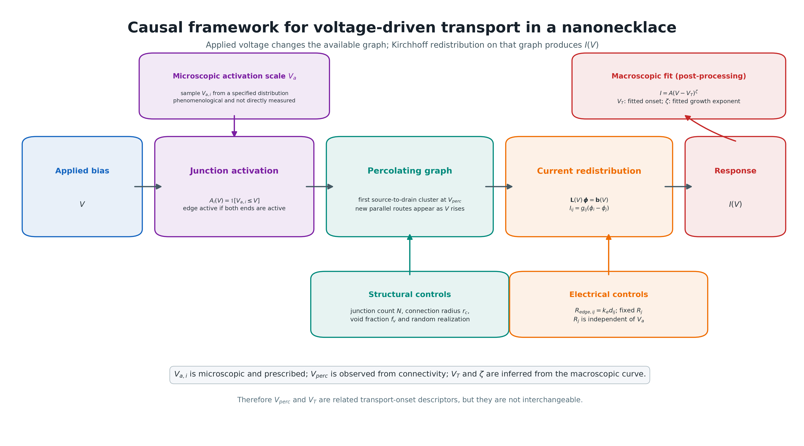

# Graph-Based Kirchhoff Modeling of Nanoparticle Necklace Networks

[](https://doi.org/10.48550/arXiv.2607.03698)
[](https://www.python.org/)
[](#verification)
[](LICENSE)
[](https://oissakah.github.io/nanonecklace.html)

> **Preprint:** *Graph-Based Kirchhoff Modeling of Non-Ohmic Electron Transport in Self-Assembled Nanonecklace Networks*  
> **Authors:** Obed Issakah, Srivathsan Badrinarayanan, Ravi F. Saraf, Janghoon Ock  
> **DOI:** [10.48550/arXiv.2607.03698](https://doi.org/10.48550/arXiv.2607.03698)

This repository implements a physics-based graph framework for studying how **voltage-driven activation, percolation, topology, and current redistribution** produce nonlinear electrical transport in self-assembled nanoparticle necklace networks.

## Research question

**How does a changing microscopic conducting network produce the macroscopic non-Ohmic current measured across the material?**

Instead of fitting the terminal `I–V` curve as a black box, the model resolves the evolving internal electrical state: active nodes, conducting components, nodal potentials, edge currents, source–drain connectivity, and graph-level transport diagnostics.

```text
applied voltage V
      ↓
junction activation
      ↓
source–drain percolation
      ↓
Kirchhoff solution on the active graph
      ↓
edge-current redistribution
      ↓
macroscopic I(V)
```



## What this repository provides

- a voltage-dependent active-graph representation of the nanonecklace;
- a sparse Kirchhoff solver with explicit source/drain boundary conditions;
- nodal-potential and edge-current reconstruction;
- voltage-resolved percolation and connectivity diagnostics;
- conductance-weighted spectral metrics, including `λ₂ [S]`;
- multiseed and parameter-sweep workflows;
- publication-oriented analysis and plotting code;
- regression tests for physical and numerical consistency;
- UNL SWAN / SLURM scripts for reproducible HPC runs.

The public portfolio gives a concise scientific overview; this README documents the model and reproducibility details.

- [Project story](https://oissakah.github.io/nanonecklace.html)
- [Preprint](https://doi.org/10.48550/arXiv.2607.03698)
- [Causal-framework source](framework_diagram/)

## Model definition

### Voltage-dependent activation

Each junction `i` is assigned a microscopic activation voltage `V_a,i`. It is active when

```math
V_{a,i} \le V .
```

where `V` is the applied device voltage. An edge is available only when both endpoint junctions are active. This is a phenomenological global-voltage gating rule; activation is not solved self-consistently from the local voltage drop.

### Resistance model

The geometric resistance of an edge is

```math
R_{\mathrm{edge},ij}=k_{\mathrm{edge}}\,d_{ij}.
```

The junction resistance is fixed and independent of `V_a,i`:

```math
R_{\mathrm{node}}=R_{\mathrm{junction}}.
```

In the implementation, `R_junction` is specified by **node_resistance_ohm**.

For each active undirected connection, the solver uses the symmetric total resistance

```math
R_{\mathrm{tot},ij}=R_{\mathrm{edge},ij}+\frac{R_i+R_j}{2}, \qquad g_{ij}=\frac{1}{R_{\mathrm{tot},ij}}.
```

Electrode-contact nodes contribute zero junction resistance. This formulation avoids split-node orientation artifacts and keeps activation timing separate from electrical resistance.

### Kirchhoff solution

Only active connected components touching both electrode sets are included in the electrical solve. The conductances form a symmetric weighted graph Laplacian `G`:

```math
G_{ii}=\sum_j g_{ij},
\qquad
G_{ij}=-g_{ij}\quad(i\ne j).
```

Source-contact nodes are fixed at `V`, drain-contact nodes at `0`, and the internal potentials are obtained from the sparse nodal system. Every edge current then comes from the same solution:

```math
I_{ij}=g_{ij}\left(\phi_i-\phi_j\right).
```

Source and drain boundary currents are calculated independently. The reported device current is their symmetric average,

```math
I(V)=\frac{\left|I_{\mathrm{source}}\right|+\left|I_{\mathrm{drain}}\right|}{2}.
```

and the absolute difference is stored as a current-conservation diagnostic.

The current framework contains no tunneling multiplier, path-current approximation, or simple-path current summation.

## Threshold and power-law convention

The macroscopic threshold is defined directly from the sampled simulation:

```math
V_T \equiv V_{\mathrm{perc}}.
```

It is the first sampled voltage at which the active network spans source to drain and the device current becomes nonzero. It is not extrapolated as a free fitting parameter.

Above this threshold, the nonlinear region is described by

```math
I=A\left(V-V_T\right)^{\zeta},
```

with `V_T` held fixed. Only `A` and `ζ` are fitted in logarithmic coordinates. The threshold point itself is excluded because

```math
\log\!\left(V-V_T\right)
```

is undefined at `V = V_T`. The fit ends when 90% of the nodes are active; if 90% activation is not reached, the remaining available window is used, up to the configured maximum fit width.

The CSV field **fit_V_T_V** is retained for compatibility, but it is identical to **percolation_voltage_V** in this framework.

## Internal diagnostics

The voltage sweep records:

- activated and conducting node/edge counts;
- source–drain connectivity;
- source, drain, and total device currents;
- current-balance error;
- effective resistance and conductance;
- current participation ratio and backbone size;
- connected-component statistics;
- edge-current distribution statistics;
- conductance-weighted algebraic connectivity `λ₂` in siemens `[S]`;
- the number of edge-disjoint source–drain pathways at `V_perc`.

Roundoff-level edge currents are excluded from distribution statistics using

```math
|I_{ij}|>\max\!\left(10^{-30}\,\mathrm{A},\;10^{-12}\max_{k\ell}|I_{k\ell}|\right).
```

## Parameter studies

The parameter driver supports:

- **Case 1:** activation-voltage width `σ_a`;
- **Case 2:** mean activation voltage `⟨V_a⟩`;
- **Case 3:** crossed `N × ⟨V_a⟩` study;
- **Case 4:** network density through node count `N`;
- **Case R:** random void fraction `f_v`.

For Cases 3 and 4, `N` is the density variable. The domain and connection radius remain fixed at

```math
r_c=0.15
```

for

```math
N=200,\;400,\;600,\;800.
```

Increasing `N` therefore increases the number of nearby neighbors and edges. The older `N^(-1/2)` radius scaling is not used.

Void cases report both requested and achieved void fractions. The achieved fraction is calculated from the union area, so overlapping voids are counted only once.

## Repository layout

```text
nanoparticle_network.py       canonical network and Kirchhoff solver
sweep_analysis.py             voltage-resolved diagnostics and CSV exports
spectral_analysis.py          effective resistance and spectral metrics
run_sweep_analysis.py         default single-seed run
run_multiseed_iv.py           default multiseed run
parameter_analysis/           parameter-study implementation
optimized_config.yaml         default physical and numerical parameters
tests/                        model-consistency regression tests
swan/                         core UNL SWAN setup and simulation jobs
docs/MODEL_CORRECTIONS.md     summary of modeling corrections
```

The root parameter-study modules are retained as backward-compatible copies. The maintained parameter-study entry point is `parameter_analysis/parameter_sweep_cases.py`.

## Installation

Python 3.10 or newer is recommended.

```bash
python -m pip install -r requirements.txt
```

## Running locally

Default single-seed calculation:

```bash
python run_sweep_analysis.py
```

Default multiseed calculation:

```bash
python run_multiseed_iv.py Results_multiseed
```

Parameter studies:

```bash
python parameter_analysis/parameter_sweep_cases.py
```

Validate the fixed-radius density definition:

```bash
python parameter_analysis/validate_N_density_fix.py
```

## Running on UNL SWAN

From the repository root:

```bash
bash swan/setup_environment.sh
mkdir -p logs
sbatch swan/run_single_seed.sbatch
sbatch swan/run_multiseed.sbatch
sbatch swan/run_parameter_sweep.sbatch
```

## Verification

Run the regression tests before using a new result set:

```bash
pytest -q
```

The tests check current conservation, resistance consistency, Laplacian symmetry and positive semidefiniteness, activation/resistance decoupling, edge-disjoint pathway counting, the fixed-radius density definition, and the fixed-threshold power-law convention.

## Citation

If you use this code, please cite the public preprint:

```bibtex
@article{issakah2026nanonecklace,
  title   = {Graph-Based Kirchhoff Modeling of Non-Ohmic Electron Transport in Self-Assembled Nanonecklace Networks},
  author  = {Issakah, Obed and Badrinarayanan, Srivathsan and Saraf, Ravi F. and Ock, Janghoon},
  journal = {arXiv preprint arXiv:2607.03698},
  year    = {2026},
  doi     = {10.48550/arXiv.2607.03698}
}
```

## License

MIT License. See `LICENSE`.
